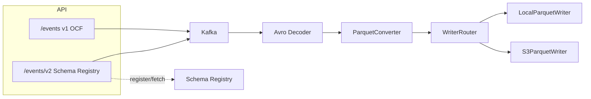

# Kafka REST API to S3 (Parquet Sink)

This repository contains two Spring Boot applications that work together:

- `api/` provides a REST API that publishes Avro-encoded events to Kafka.
- `s3-sink/` consumes those events, converts Avro to Parquet, and writes output to a local directory
  (for demo/testing) or to S3 (production).

Two encoding modes are supported:
- **v1 (OCF)**: Schema embedded in each message. Topic `events`. Endpoints `/events`, `/events/stream`.
- **v2 (Schema Registry)**: Schema stored in Confluent Schema Registry. Topic `events-schema-registry`. Endpoints `/events/v2`, `/events/v2/stream`.

## Architecture overview



## Modules

- `api/` — high-throughput REST API producer with Avro encoding (OCF or Schema Registry).
  See `api/API.md` for API usage and Kafka setup details.
- `s3-sink/` — Kafka consumer that writes Parquet to local or S3. Supports both OCF and Schema Registry wire formats.
  See `s3-sink/S3-Sink.md` for sink behavior and configuration.

## Key configuration (high level)

- API Kafka topics: `EVENTS_TOPIC` (default `events`), `EVENTS_SCHEMA_REGISTRY_TOPIC` (default `events-schema-registry`)
- API Schema Registry: `SCHEMA_REGISTRY_URL` (required for v2 endpoints)
- API security/profile: `SPRING_PROFILES_ACTIVE=local` disables OAuth2 and uses PLAINTEXT Kafka
- Sink input/output mappings: `app.source-topics` and `app.mappings` control topic routing
- Sink Schema Registry: `SCHEMA_REGISTRY_URL` or `app.schema-registry-url` (required to decode Schema Registry format)
- Sink batching: `app.batch.maxRecords` and `app.batch.flushInterval`
- Sink S3 endpoint override (LocalStack/testing): `app.s3.endpoint` (env `APP_S3_ENDPOINT`)

See module docs for full configuration reference:
- `api/API.md`
- `s3-sink/S3-Sink.md`

## Prerequisites

- Java 21
- Docker Desktop (for local Kafka, optional LocalStack)
- Gradle wrapper included (`./gradlew`)

## Docker Compose demo (API -> Kafka -> Schema Registry -> Parquet -> LocalStack S3)

This demo brings up Kafka, Schema Registry, LocalStack, the API, and the sink with a single compose file.
The sink runs with the `demo-s3` profile, which targets LocalStack S3 and consumes from both `events` and `events-schema-registry` topics.

### 1) Start the stack

```bash
docker compose up --build
```

### 2) Publish test events

Use Python for correct JSON escaping of nested payloads:

```bash
python3 - <<'PY' | curl -N --no-buffer -X POST http://localhost:8080/events/stream \
  -H "Content-Type: application/x-ndjson" -H "x-ack-mode: wait" --data-binary @-
import json
for i in range(1, 101):
    payload = json.dumps({"userId": f"{i:03d}"})
    print(json.dumps({"id": f"evt-{i:03d}", "type": "user.created", "payload": payload}))
PY
```

To publish to the v2 Schema Registry endpoint instead:

```bash
python3 - <<'PY' | curl -N --no-buffer -X POST http://localhost:8080/events/v2/stream \
  -H "Content-Type: application/x-ndjson" -H "x-ack-mode: wait" --data-binary @-
import json
for i in range(1, 101):
    payload = json.dumps({"userId": f"{i:03d}"})
    print(json.dumps({"id": f"evt-sr-{i:03d}", "type": "user.created", "payload": payload}))
PY
```

### 3) Verify objects in LocalStack S3

```bash
AWS_ACCESS_KEY_ID=test AWS_SECRET_ACCESS_KEY=test AWS_DEFAULT_REGION=us-east-1 \
  aws --endpoint-url=http://localhost:4566 s3 ls s3://demo-parquet-bucket/events/
  aws --endpoint-url=http://localhost:4566 s3 ls s3://demo-parquet-bucket/events-schema-registry/
```

### Automated local test (v1 + v2)

Run the script to start the stack (if needed), publish to both v1 and v2 endpoints, and verify S3 output:

```bash
./scripts/local-demo-test.sh
```

Requires `docker compose`, `curl`, `aws` CLI, and `python3`. Exits on first failure with diagnostic output.

## Local demo (API -> Kafka -> Parquet -> local directory)

This demo uses a local Kafka broker in Docker and writes Parquet files to a local directory.

### 1) Start Kafka (Docker)

```bash
docker stop kafka && docker rm kafka
docker run -d --name kafka -p 9092:9092 \
  -e KAFKA_NODE_ID=1 \
  -e KAFKA_PROCESS_ROLES='broker,controller' \
  -e KAFKA_LISTENERS='PLAINTEXT://0.0.0.0:9092,CONTROLLER://0.0.0.0:9093' \
  -e KAFKA_ADVERTISED_LISTENERS='PLAINTEXT://localhost:9092' \
  -e KAFKA_CONTROLLER_QUORUM_VOTERS='1@localhost:9093' \
  -e KAFKA_CONTROLLER_LISTENER_NAMES='CONTROLLER' \
  -e KAFKA_LISTENER_SECURITY_PROTOCOL_MAP='CONTROLLER:PLAINTEXT,PLAINTEXT:PLAINTEXT' \
  -e KAFKA_OFFSETS_TOPIC_REPLICATION_FACTOR=1 \
  -e KAFKA_TRANSACTION_STATE_LOG_REPLICATION_FACTOR=1 \
  -e KAFKA_TRANSACTION_STATE_LOG_MIN_ISR=1 \
  -e KAFKA_GROUP_INITIAL_REBALANCE_DELAY_MS=0 \
  -e CLUSTER_ID='MkU3OEVBNTcwNTJENDM2Qk' \
  confluentinc/cp-kafka:latest
```

Create the `events` topic:

```bash
docker exec -it kafka kafka-topics --bootstrap-server localhost:9092 \
  --create --topic events --partitions 1 --replication-factor 1
```

### 2) Run the API (producer)

```bash
./gradlew :api:localBootRun
```

### 3) Run the sink (consumer -> Parquet)

The `demo` profile is configured to use PLAINTEXT Kafka and write Parquet to a local directory.

```bash
export LOCAL_OUTPUT_DIR=/tmp/kafka-s3-sink
SPRING_PROFILES_ACTIVE=demo ./gradlew :s3-sink:bootRun
```

### 4) Publish test events

```bash
curl -X POST http://localhost:8080/events \
  -H "Content-Type: application/json" \
  -d '{"id":"evt-1","type":"user.created","payload":"{\"userId\":\"123\"}"}'
```

Publish a larger batch (NDJSON stream). Use Python for correct JSON escaping:

```bash
python3 - <<'PY' | curl -N --no-buffer -X POST http://localhost:8080/events/stream \
  -H "Content-Type: application/x-ndjson" -H "x-ack-mode: wait" --data-binary @-
import json
for i in range(1, 101):
    payload = json.dumps({"userId": f"{i:03d}"})
    print(json.dumps({"id": f"evt-{i:03d}", "type": "user.created", "payload": payload}))
PY
```

### 5) Verify output

Parquet files are written under a partitioned layout:

```
/tmp/kafka-s3-sink/events/topic=events/date=YYYY-MM-DD/
```

List files:

```bash
ls -la /tmp/kafka-s3-sink/events/topic=events/date=*
```

If you have `parquet-tools`, inspect a single file:

```bash
parquet-tools schema /tmp/kafka-s3-sink/events/topic=events/date=YYYY-MM-DD/<file>.parquet
```

To print rows:

```bash
parquet-tools cat /tmp/kafka-s3-sink/events/topic=events/date=YYYY-MM-DD/<file>.parquet
```

Install `parquet-tools`:

```bash
brew install parquet-tools
```

Or download a release from the [Apache Parquet Tools repository](https://github.com/apache/parquet-java/tree/master/parquet-tools)


## LocalStack S3 variant (not recommended - use Docker Compose if possible)

You can point the sink at a LocalStack S3 bucket instead of a local directory.

1) Start LocalStack:

```bash
docker run -d --name localstack -p 4566:4566 localstack/localstack:3.7.1
```

2) Create a bucket:

```bash
AWS_ACCESS_KEY_ID=test AWS_SECRET_ACCESS_KEY=test AWS_DEFAULT_REGION=us-east-1 \
  aws --endpoint-url=http://localhost:4566 s3 mb s3://demo-parquet-bucket
```

3) Run the sink with the `demo-s3` profile:

```bash
export APP_S3_ENDPOINT=http://localhost:4566
SPRING_PROFILES_ACTIVE=demo-s3 ./gradlew :s3-sink:bootRun
```

4) Verify objects:

```bash
AWS_ACCESS_KEY_ID=test AWS_SECRET_ACCESS_KEY=test AWS_DEFAULT_REGION=us-east-1 \
  aws --endpoint-url=http://localhost:4566 s3 ls s3://demo-parquet-bucket/events/topic=events
```

which gives you the date it will write to:
```output
                           PRE date=2026-02-08/
```

which we can plug in to get the actual files:

```bash
AWS_ACCESS_KEY_ID=test AWS_SECRET_ACCESS_KEY=test AWS_DEFAULT_REGION=us-east-1 \
  aws --endpoint-url=http://localhost:4566 s3 ls s3://demo-parquet-bucket/events/topic=events/date=2026-02-08
```

which shows the parquet:

```output
2026-02-08 13:14:19       1455 073bed9c-d363-4398-a818-a046ee6e9b6f.parquet
2026-02-08 13:14:21       1453 075d5437-1844-4c5d-b5f4-4999403bb9f3.parquet
2026-02-08 13:14:19       1454 0995f073-a79d-4b38-85ad-79f9d5432867.parquet
```

## Notes and troubleshooting

- The sink supports two Avro wire formats:
  - **OCF** (Object Container File): schema embedded in each message. Used by v1 API.
  - **Schema Registry**: Confluent format (magic byte + schema ID + binary). Used by v2 API. Requires `SCHEMA_REGISTRY_URL`.

- The v2 endpoints (`/events/v2`, `/events/v2/stream`) are only available when `SCHEMA_REGISTRY_URL` is configured.

- Use Python (or another JSON library) when generating NDJSON with nested JSON in the `payload` field. Shell `printf` escaping can produce invalid JSON.

- If you change topic names, update `EVENTS_TOPIC` / `EVENTS_SCHEMA_REGISTRY_TOPIC` in the API and `app.source-topics` / `app.mappings` in the sink.

- Module docs with deeper detail:
  - `api/API.md`
  - `s3-sink/S3-Sink.md`
